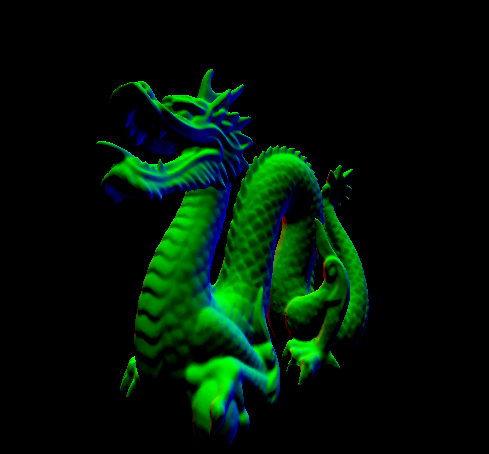
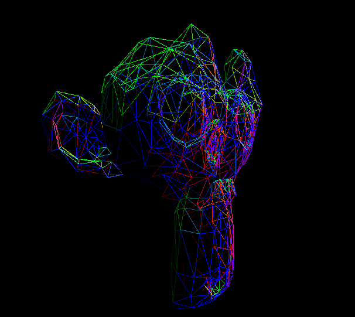

# `Soulkan`

A **powerful** and **concise** library for **simplifying** [Vulkan](https://github.com/KhronosGroup/Vulkan-Headers) and its quirks !

# Features

- The more secure [vulkan.hpp](https://github.com/KhronosGroup/Vulkan-Hpp) bindings
- Memory allocation management with VMA
- Runtime shader compilation with shaderc
- Window management with GLFW
- Arbitrary triangulated mesh loading with TinyObjLoader
- Maths with GLM

# Goals
- **Simplifying** the Vulkan API
- Making it easier to use **without sacrificing details**
- Improving program **readability**

# Mesh loading

*courtesy of the [McGuire Computer Graphics Archive](http://casual-effects.com/data/index.html)*